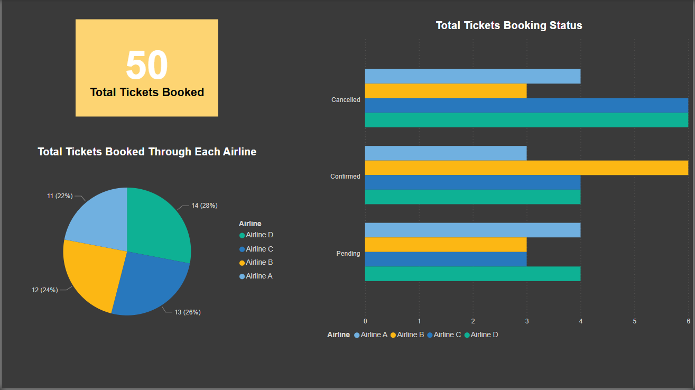
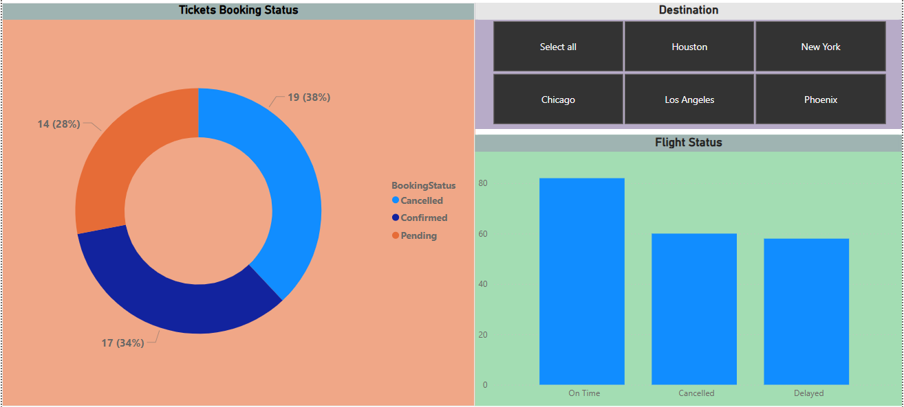
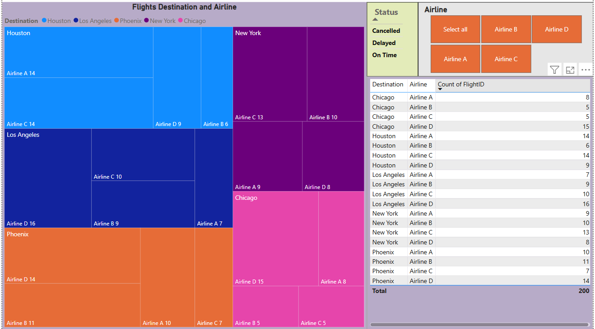
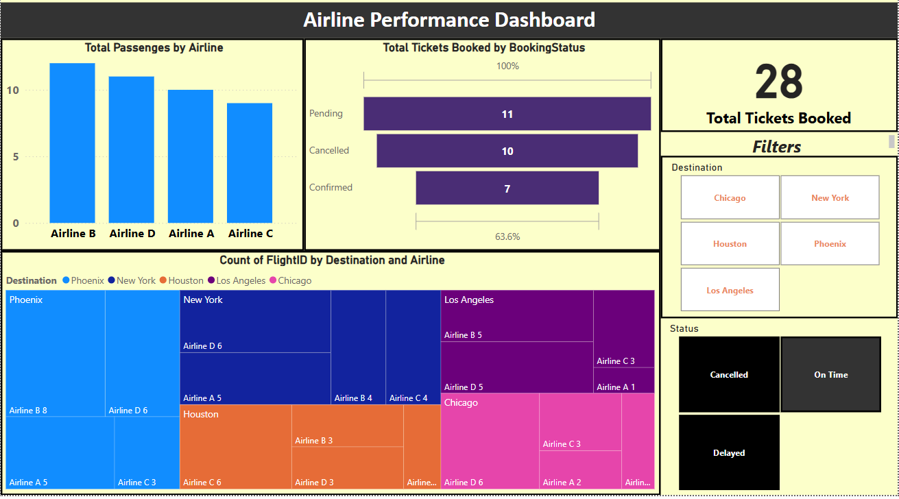

# ✈️ Airline Data Management and Analysis Using Power BI

## Project Overview

This Power BI project analyzes operational and ticketing data from an airline system to generate insights for improved efficiency and customer satisfaction. The project involves cleaning and modeling data from three sources, performing DAX calculations, and building an interactive dashboard with visual insights.

---

## Datasets Used

1. [📄 Flight Information](https://docs.google.com/spreadsheets/d/1PwnpBEUiG5A-tEKgxnjKsEmud4ZzUKT2yV5WgMHxrPk/edit?gid=1262897191#gid=1262897191)  
   Columns: `FlightID`, `FlightNumber`, `Airline`, `Destination`, `Status`

2. [📄 Ticket Information](https://docs.google.com/spreadsheets/d/1Z2E6tvuZodoru_h52cFQWrMZTkf69ynyai8KjPKRDkk/edit?gid=435997425#gid=435997425)  
   Columns: `TicketID`, `FlightID`, `BookingStatus`

3. [📄 Passenger Information](https://docs.google.com/spreadsheets/d/1p3K0MWxbzDp1T8FJ168Hgw7WDnEURzvFxhPhEdmqqzI/edit?gid=1870640173#gid=1870640173)  
   Columns: `PassengerID`, `FlightID`, `SeatNumber`
---

## Key Tasks Performed

### 1. Data Preparation & Cleaning
- Cleaned null values and removed duplicates using Power Query
- Standardized columns for analysis

### 2. Data Modeling
- Created relationships between `FlightID` across datasets
- Configured cardinality and cross-filtering in the data model

### 3. Enhanced Data Insights
- Added a conditional column to classify flights as `"Best"` or `"To Be Improved"` based on status
- Used “Column from Examples” to extract flight numbers

### 4. DAX Calculations
- Total passengers per flight
- Total tickets booked
- Filtered tables for "Best" flights only

### 5. Visualizations & Interactivity
- Built visuals for:
  - Passenger count by airline
  - Ticket booking status
  - Flights by destination
- Added slicers, quick views, and airline-specific report pages

### 6. Dashboard & Power BI Service
- Designed a final summary dashboard
- Configured Row-Level Security (RLS) for "Airline A"
- Scheduled dataset refresh daily at 5 PM

---

## Tools & Features Used

- Power Query
- Power BI Data Model
- DAX Calculations
- Row-Level Security (RLS)
- Slicers & Filters
- Scheduled Refresh

---

##  Screenshots

###  Tickets Booked Visual

###  Ticket Distribution

###  Flight Distribution visual

###  Final Dashboard

## Project Outcome
- Cleaned and modeled relational airline data
- Generated operational and customer insights
- Delivered a visual, interactive dashboard for decision-makers
